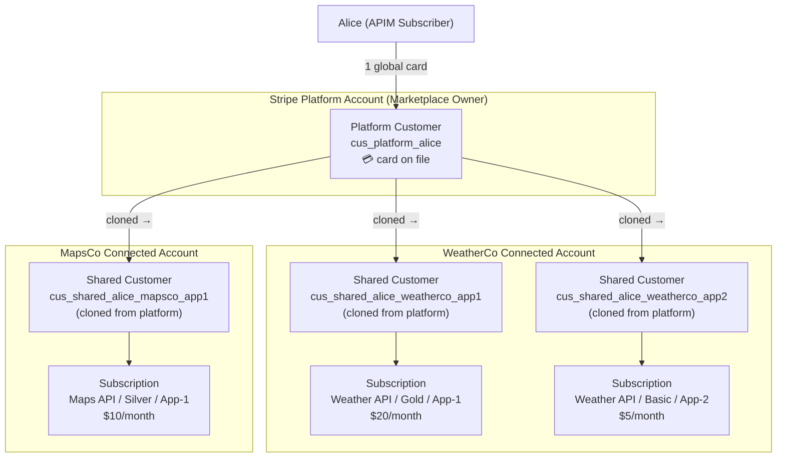
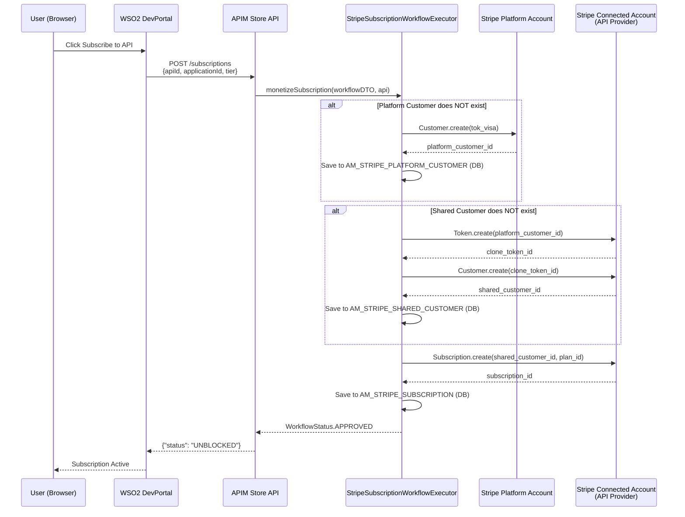
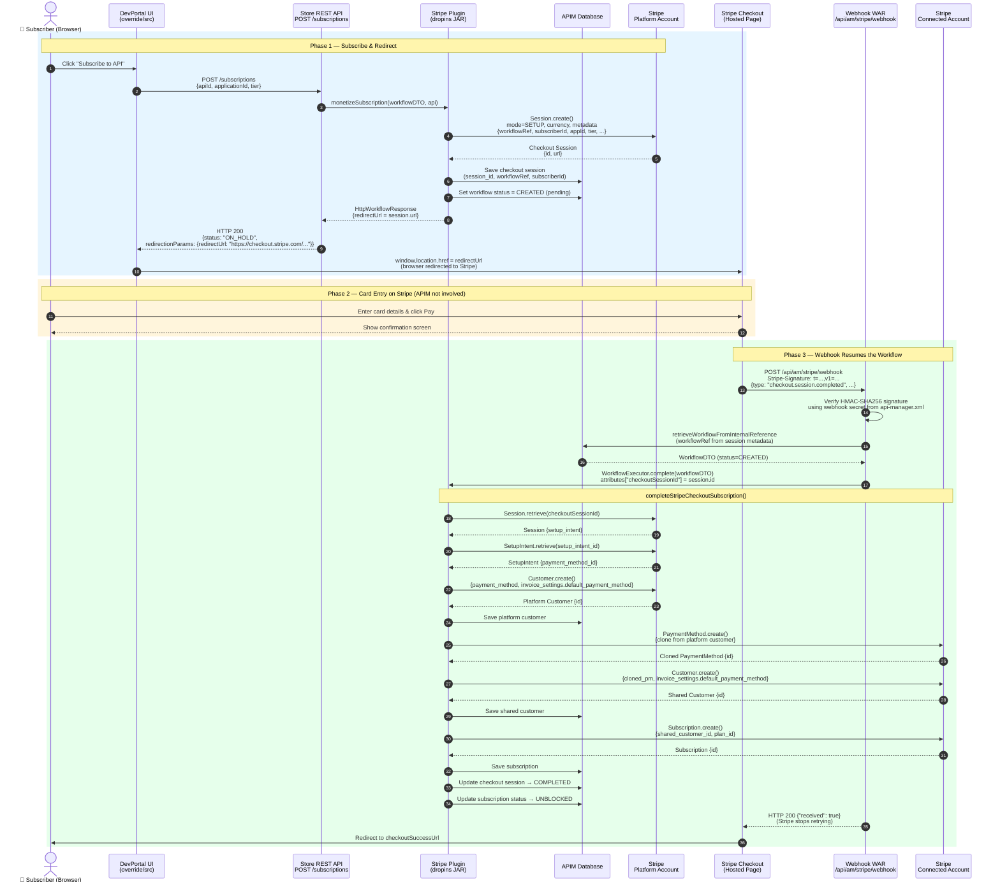
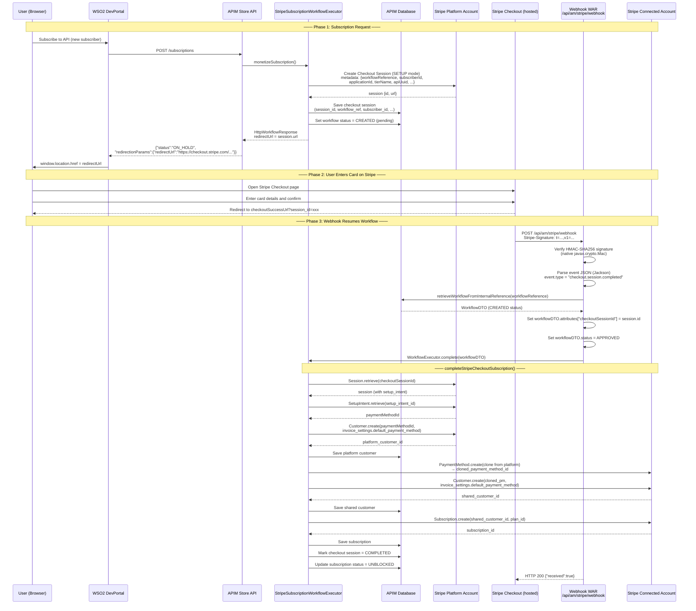
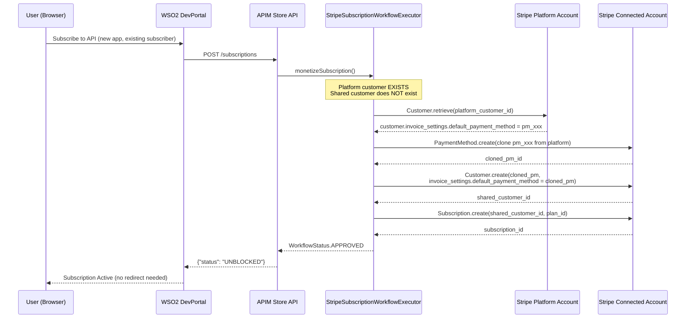

# WSO2 APIM Stripe Monetization — Customization Documentation

## Overview

This document describes:
1. How the **default** WSO2 APIM Stripe monetization subscription workflow operates out-of-the-box.
2. The **custom enhancements** implemented to support real payment method collection via Stripe Checkout, browser redirection, webhook-driven workflow resumption, and multi-application subscriber support.

---

## Part 1 — Default WSO2 APIM Stripe Subscription Flow

### 1.1 Architecture Components

| Component | Role |
|---|---|
| **WSO2 DevPortal** | Frontend where subscribers discover and subscribe to APIs |
| **APIM Store REST API** | Backend REST endpoint (`POST /subscriptions`) that processes subscription requests |
| **`StripeSubscriptionCreationWorkflowExecutor`** | OSGi bundle (dropins JAR) that handles the Stripe-specific logic during subscription creation |
| **Stripe Platform Account** | The API Marketplace owner's Stripe account — holds subscriber (platform) customers |
| **Stripe Connected Account** | Each API Provider's Stripe account — holds shared customers and subscriptions |

### 1.2 Stripe Customer Model

WSO2's Stripe integration uses a **platform / connected account split**. Think of it like a shopping mall:

- The **mall management** (WSO2 APIM admin) owns the building and issues a loyalty card to every shopper.
- Each **shop inside the mall** (API Provider) has its own Stripe account and needs to know who their paying customers are.
- A **shopper** (API Subscriber) gets one loyalty card from the mall, but each shop they visit creates their own record of that customer so they can charge them independently.

This translates to three Stripe objects:

| Stripe Object | Belongs To | Created When | Purpose |
|---|---|---|---|
| **Platform Customer** | Marketplace owner's Stripe account | First time subscriber ever subscribes to **any** API | Single global identity for the subscriber — payment method lives here |
| **Shared Customer** | API Provider's connected Stripe account | Each time subscriber uses a **new application** with a **new provider** | Local copy of the subscriber on that provider's account — needed so the provider can bill them |
| **Subscription** | API Provider's connected Stripe account | Each API subscription | Links the shared customer to a specific API tier's billing plan, and triggers recurring charges |

---

#### Concrete Example

Suppose the API marketplace has two providers:
- **WeatherCo** — publishes `Weather API`
- **MapsCo** — publishes `Maps API`

And a subscriber **Alice** who has two applications: **App-1** and **App-2**.

Here is what gets created in Stripe as Alice subscribes to different APIs:

| Alice's Action | Platform Customer | Shared Customer Created | Subscription Created |
|---|---|---|---|
| Subscribes to Weather API with App-1 | `cus_platform_alice` *(created now)* | `cus_shared_alice_weatherco_app1` on WeatherCo account | `sub_weatherco_app1_gold` |
| Subscribes to Maps API with App-1 | `cus_platform_alice` *(reused)* | `cus_shared_alice_mapsco_app1` on MapsCo account | `sub_mapsco_app1_silver` |
| Subscribes to Weather API with App-2 | `cus_platform_alice` *(reused)* | `cus_shared_alice_weatherco_app2` on WeatherCo account *(new — different app)* | `sub_weatherco_app2_basic` |

**Key rules:**
- There is always exactly **1 platform customer per subscriber** (across the whole marketplace).
- There is **1 shared customer per (subscriber application, API provider) pair** — the same application connecting to two different providers creates two separate shared customers.
- There is **1 subscription per (shared customer, API tier)** pair — subscribing to a different tier of the same API creates a new subscription.

---

#### Why the Split?

Stripe's connected account model requires that subscriptions and charges be created **on the connected account** (the provider), not on the platform. However, the payment method (the card) is stored on the **platform account** because the subscriber registered there. The shared customer is a "clone" that lets the provider charge through the platform's stored card without the subscriber needing to re-enter their card for every provider.



### 1.3 Default Subscription Flow

In the default implementation, when a user subscribes to a monetized API, the workflow executor performs all Stripe operations **synchronously** and **immediately** marks the subscription as `UNBLOCKED` (active).

The critical detail: the default implementation creates the platform customer using a **Stripe test token `tok_visa`** hardcoded in `StripeMonetizationConstants.DEFAULT_TOKEN`. This is a Stripe test card token intended for test environments — it does not collect any real payment information from the subscriber.



### 1.4 Limitations of the Default Implementation

| Limitation | Impact |
|---|---|
| **Uses `tok_visa` test token** | No real payment information is collected from the subscriber. Subscriptions are approved without any card on file. |
| **Synchronous — no user interaction** | The subscriber is never asked for their payment details. |
| **Not production-ready for billing** | Stripe subscriptions created this way cannot charge real customers. |
| **No redirect mechanism** | The workflow always returns `GeneralWorkflowResponse` which results in `status: UNBLOCKED` immediately — no way to pause the flow for external input. |

---

## Part 2 — Custom Implementation: Stripe Checkout with Real Payment Collection

### 2.1 Goals

1. Collect **real payment methods** from new subscribers using Stripe's hosted Checkout page.
2. **Redirect** the subscriber's browser to Stripe Checkout during the subscription flow.
3. **Resume** the APIM subscription workflow automatically after the subscriber enters their card.
4. Support subscribers with **multiple applications** subscribing to APIs (reuse existing payment method).

### 2.2 Solution Architecture

The full flow spans three phases. The sequence diagram below shows every participant and every message in order.



### 2.3 Component Changes

#### A. `StripeSubscriptionCreationWorkflowExecutor` (Plugin JAR)

Three new decision points were added to `monetizeSubscription()`:

**Decision 1 — New Subscriber (no platform customer)**
Instead of creating a platform customer with `tok_visa`, the executor now:
1. Creates a **Stripe Checkout Session** in `SETUP` mode on the platform account.
2. Stores the session ID and workflow reference in the `AM_STRIPE_CHECKOUT_SESSIONS` database table.
3. Sets the workflow status to `CREATED` (pending — do not approve yet).
4. Returns an `HttpWorkflowResponse` with the Checkout Session URL as the redirect URL.
5. APIM serialises this into `redirectionParams` in the subscription API response.

**Decision 2 — Platform Customer exists, new Application (no shared customer)**
When the subscriber already has a platform customer (from a previous subscription) but subscribes with a new application:
- The executor checks if the platform customer has a `default_payment_method` set.
- If **yes** (created via Checkout): clones the payment method to the connected account and creates a shared customer with that payment method as default. No new Checkout redirect needed.
- If **no** (created via legacy `tok_visa` path): falls back to the old `Token.create` approach.

**Decision 3 — Both customers exist**
Proceeds directly to creating the Stripe Subscription (unchanged from default).

#### B. DevPortal UI Override (`override/src/app/components/`)

Two components were updated in the DevPortal override directory (takes precedence over source at runtime):

- `Applications/Details/Subscriptions.jsx` — the subscriptions panel inside the Application detail view.
- `Apis/Details/Credentials/Credentials.jsx` — the credentials/subscription panel inside the API detail view.

When the subscription API responds with `status: ON_HOLD`, the UI now:
1. Reads the `redirectionParams` field from the response body.
2. Parses it as JSON to extract `redirectUrl`.
3. Immediately redirects the browser (`window.location.href = redirectUrl`) to the Stripe Checkout page.
4. Falls back to showing a "pending approval" message if no redirect URL is present.

Previously, these override files called a custom `/api/am/stripe/checkout-url` endpoint, which failed because it looked up the checkout session using the subscription UUID, but the database stored a numeric workflow reference — causing a mismatch and returning 404.

#### C. Stripe Webhook WAR (`api#am#stripe.war`)

A standalone Java web application (WAR) deployed at `/api/am/stripe/` on the Carbon server. It exposes:

- `POST /api/am/stripe/webhook` — receives `checkout.session.completed` events from Stripe.

Key design decisions:
- **No stripe-java dependency** — stripe-java 24.x requires Gson 2.10+ (`GsonBuilder.addReflectionAccessFilter`), but the Carbon OSGi classloader exposes an older Gson version that shadows the WAR's bundled copy, causing `NoSuchMethodError` at startup. Instead, Stripe signature verification is implemented natively using Java's `javax.crypto.Mac` (HMAC-SHA256).
- **Jackson for JSON parsing** — the event payload is parsed with Jackson's `ObjectMapper` (already bundled via `jackson-jaxrs-json-provider`), eliminating the Gson dependency entirely.
- **Delegates workflow completion to the plugin** — the WAR only extracts the `workflowReference` from the session metadata and calls `WorkflowExecutorFactory.getWorkflowExecutor().complete()`. The actual Stripe customer/subscription creation runs inside `StripeSubscriptionCreationWorkflowExecutor.complete()` in the plugin OSGi bundle.

### 2.4 End-to-End Custom Flow



### 2.5 Second Application Subscription Flow (Returning Subscriber)

When a subscriber who already went through Checkout creates a **second application** and subscribes to an API, the flow is shorter — no new Checkout is needed:



### 2.6 Stripe Webhook WAR — Signature Verification Detail

Stripe signs every webhook delivery with HMAC-SHA256. The verification logic (implemented natively, no stripe-java) works as follows:

```mermaid
flowchart TD
    A[POST /api/am/stripe/webhook] --> B{Stripe-Signature<br/>header present?}
    B -- No --> Z1[400 Bad Request]
    B -- Yes --> C{Webhook secret<br/>configured?}
    C -- No --> Z2[500 Internal Server Error]
    C -- Yes --> D[Parse header:<br/>t=timestamp, v1=signature]
    D --> E{timestamp within<br/>±5 minute window?}
    E -- No --> Z3[400 Replay Attack Rejected]
    E -- Yes --> F[Compute<br/>HMAC-SHA256 of<br/>timestamp.payload<br/>using webhookSecret]
    F --> G{computedSig<br/>== v1 signature?}
    G -- No --> Z4[400 Invalid Signature]
    G -- Yes --> H[Parse event JSON<br/>with Jackson]
    H --> I{event.type?}
    I -- checkout.session.completed --> J[Extract workflowReference<br/>from session metadata]
    I -- other --> K[Ignore — return 200]
    J --> L[Load WorkflowDTO from DB]
    L --> M[Set checkoutSessionId attribute]
    M --> N[WorkflowExecutor.complete()]
    N --> O[200 OK — Stripe stops retrying]
```

### 2.7 Database Tables Used

| Table | Purpose |
|---|---|
| `AM_WORKFLOWS` | Stores workflow state (CREATED → APPROVED). Primary key for resumption. |
| `AM_STRIPE_PLATFORM_CUSTOMER` | Maps APIM subscriber ID to Stripe platform customer ID |
| `AM_STRIPE_SHARED_CUSTOMER` | Maps application + API provider to Stripe connected-account customer ID |
| `AM_STRIPE_SUBSCRIPTION` | Maps APIM subscription to Stripe subscription ID |
| `AM_STRIPE_CHECKOUT_SESSIONS` | (New) Stores active checkout sessions: session ID, workflow reference, subscriber, status |

### 2.8 Configuration

**`workflow-extensions.xml`** — two new properties on the executor:
```xml
<Executor name="org.wso2.apim.monetization.impl.workflow.StripeSubscriptionCreationWorkflowExecutor">
    <Property name="checkoutSuccessUrl">https://&lt;devportal-host&gt;:9443/devportal/subscription/success</Property>
    <Property name="checkoutCancelUrl">https://&lt;devportal-host&gt;:9443/devportal/subscription/cancel</Property>
</Executor>
```

**`api-manager.xml`** — webhook signing secret:
```xml
<Monetization>
    <StripeWebhookSecret>whsec_your_signing_secret_here</StripeWebhookSecret>
</Monetization>
```

**Stripe Dashboard** — webhook endpoint registration:
- Endpoint URL: `https://<apim-host>:9443/api/am/stripe/webhook`
- Event: `checkout.session.completed`

---

## Part 3 — Issues Resolved During Development

| # | Issue | Root Cause | Fix |
|---|---|---|---|
| 1 | `Missing required param: currency` | stripe-java 24.x requires `currency` on Checkout Session for setup mode | Retrieve the Stripe Plan for the tier before creating the session; pass the plan's currency to `SessionCreateParams.setCurrency()` |
| 2 | `redirectionParams: null` in subscription response | `StripeSubscriptionCreationWorkflowExecutor` returned `GeneralWorkflowResponse` — APIM only populates `redirectionParams` when the response is `instanceof HttpWorkflowResponse` | Changed return type to `HttpWorkflowResponse` with `setRedirectUrl(checkoutSession.getUrl())` |
| 3 | UI redirect not working (`/checkout-url` returned 404) | DevPortal override files called `GET /api/am/stripe/checkout-url?subscriptionId={UUID}` but the DB stores a numeric workflow reference (`9`), not a UUID — query returned 0 rows | Removed the `/checkout-url` call; read `redirectionParams` directly from the subscription POST response |
| 4 | Webhook `NoSuchMethodError: GsonBuilder.addReflectionAccessFilter` | `stripe-java 24.x` calls Gson 2.10+ API, but the Carbon OSGi classloader exposes an older Gson that shadows the WAR's bundled copy | Removed stripe-java from the webhook WAR entirely; implemented HMAC-SHA256 verification natively with `javax.crypto.Mac` and parsed event JSON with Jackson |
| 5 | `No attached payment method` on Subscription.create | `createSharedCustomerWithPaymentMethod` attached the payment method to the customer but did not set `invoice_settings.default_payment_method` — Stripe requires this for subscription billing | Added `invoice_settings.default_payment_method = clonedPm.getId()` to the shared customer creation params |
| 6 | Second-application subscription fails — `Token.create: customer must have an active payment source` | The legacy `createSharedCustomer` uses `Token.create` which requires a Stripe **source** (legacy card) on the platform customer. Checkout-created customers have a `payment_method` instead — incompatible with the Token API | Added `getDefaultPaymentMethodId()` helper: if the platform customer has a default payment method (Checkout path), use `createSharedCustomerWithPaymentMethod`; otherwise fall back to the legacy `createSharedCustomer` |

---

## Part 4 — Deployment Checklist

```
[ ] Build the plugin JAR:
      cd wso2-am-stripe-plugin && mvn clean package
      Copy target/org.wso2.apim.monetization.impl-*.jar
          → <APIM_HOME>/repository/components/dropins/

[ ] Build the webhook WAR:
      cd wso2-am-stripe-webhook && mvn clean package
      Copy target/api#am#stripe.war
          → <APIM_HOME>/repository/deployment/server/webapps/

[ ] DevPortal UI overrides are already in place at:
      <APIM_HOME>/repository/deployment/server/webapps/devportal/
        override/src/app/components/Applications/Details/Subscriptions.jsx
        override/src/app/components/Apis/Details/Credentials/Credentials.jsx

[ ] Configure workflow-extensions.xml:
      Add checkoutSuccessUrl and checkoutCancelUrl properties

[ ] Configure api-manager.xml:
      Add <StripeWebhookSecret>whsec_...</StripeWebhookSecret> under <Monetization>

[ ] Register webhook endpoint in Stripe Dashboard:
      URL: https://<host>:9443/api/am/stripe/webhook
      Events: checkout.session.completed
               checkout.session.expired
               invoice.payment_failed
               customer.subscription.deleted
               customer.updated

[ ] Add StripeWebhookSecret to each tenant's tenant-conf.json
      (remove global StripeWebhookSecret from api-manager.xml)

[ ] Restart WSO2 APIM
```

---

## Part 5 — Robustness & Production Readiness

### 5.1 Idempotency in `complete()`

**Problem:** Stripe guarantees at-least-once webhook delivery. A second `checkout.session.completed` event for the same session will call `complete()` again and attempt to create duplicate Stripe customers and DB records.

**Fix:** At the very start of `completeStripeCheckoutSubscription()`, query `AM_STRIPE_CHECKOUT_SESSIONS` by session ID. If `STATUS = COMPLETED`, log a warning and return immediately — no Stripe API calls, no DB writes. This makes the method fully idempotent.

This guard pairs with the partial failure recovery design (5.7): if a previous run failed midway, the status is **not** `COMPLETED`, so the retry proceeds normally after rollback.

---

### 5.2 Payment Renewal Failure Handling

**Problem:** Once a Stripe subscription is created, APIM has no visibility into its payment health. A failed renewal marks the subscription `past_due` or `canceled` in Stripe but APIM remains unaware — the subscriber retains API access indefinitely without paying.

**Fix:** The webhook WAR handles two additional Stripe events:

| Event | Action |
|---|---|
| `invoice.payment_failed` | Extract `subscription` ID from the invoice object → look up the APIM subscription UUID in `AM_MONETIZATION_SUBSCRIPTIONS` → call APIM Admin REST API `POST /api/am/admin/v3/subscriptions/block-subscription?subscriptionId={uuid}` to block access |
| `customer.subscription.deleted` | Extract Stripe `subscription.id` → look up + remove from `AM_MONETIZATION_SUBSCRIPTIONS` → call APIM Admin REST API to delete the subscription record |

Stripe Dashboard: register `invoice.payment_failed` and `customer.subscription.deleted`.

---

### 5.3 Checkout Session Expiry Handling

**Problem:** If a subscriber abandons Checkout, the Stripe session expires after 24 hours. The APIM subscription stays permanently `ON_HOLD` and `AM_WORKFLOWS` record stays `CREATED`. The subscriber cannot re-subscribe because the `ON_HOLD` row blocks it.

**Fix:** The webhook WAR handles `checkout.session.expired`:

1. Extract `workflowReference` from session metadata.
2. Call `stripeMonetizationDAO.updateCheckoutSessionStatus(sessionId, CHECKOUT_SESSION_STATUS_EXPIRED)`.
3. Retrieve the `WorkflowDTO` from `AM_WORKFLOWS` via `retrieveWorkflowFromInternalReference(workflowReference)`.
4. Call APIM Admin REST API to delete the `ON_HOLD` APIM subscription, freeing the subscriber to retry.

Stripe Dashboard: register `checkout.session.expired`.

---

### 5.4 Payment Method Update Propagation

**Problem:** Shared customers in connected accounts hold a static clone of the platform customer's payment method at the time of first subscription. If the subscriber later updates their card, connected account charges will start failing.

**Fix:** The webhook WAR handles `customer.updated` on the platform account. When `invoice_settings.default_payment_method` changes:

1. Extract the Stripe platform customer ID from the event.
2. Look up all `AM_MONETIZATION_SHARED_CUSTOMERS` rows where `PARENT_CUSTOMER_ID` matches the platform customer's DB row ID.
3. For each shared customer and its connected account key:
   - Clone the new payment method: `PaymentMethod.create({customer, payment_method}, requestOptions)`.
   - Update the shared customer: `Customer.update({invoice_settings.default_payment_method = clonedPm.getId()}, requestOptions)`.
   - Detach the old cloned payment method: `PaymentMethod.detach(requestOptions)`.

Stripe Dashboard: register `customer.updated`.

---

### 5.5 Per-Tenant Webhook Secret

**Problem:** A single global `StripeWebhookSecret` in `api-manager.xml` cannot support multi-tenant deployments where each tenant has their own Stripe Platform Account and therefore their own webhook signing secret.

**Fix:** Store the webhook signing secret per tenant in `tenant-conf.json`, alongside the existing platform account key:

```json
{
  "MonetizationInfo": {
    "BillingEnginePlatformAccountKey": "sk_live_...",
    "StripeWebhookSecret": "whsec_..."
  }
}
```

New constant: `STRIPE_WEBHOOK_SECRET = "StripeWebhookSecret"` in `StripeMonetizationConstants`.

The webhook WAR must determine which tenant's secret to use before verifying the signature. Strategy: include `tenantDomain` as a field in Stripe session metadata at `Session.create()` time. The WAR extracts `tenantDomain` from the raw JSON payload (without signature verification first), loads the secret from that tenant's config, then performs the HMAC verification. This two-pass read is safe because the tenant domain itself is not a secret — the signature verification that follows prevents payload tampering.

The global `<StripeWebhookSecret>` in `api-manager.xml` is removed.

---

### 5.6 `workflowReference` Correlation — Confirmed

The correct field to store in Stripe session metadata and use for DB lookup is `workflowDTO.getExternalWorkflowReference()`. This maps to the `WF_EXTERNAL_REFERENCE` column in `AM_WORKFLOWS`.

`ApiMgtDAO.retrieveWorkflowFromInternalReference(workflowReference)` queries by this column. Store the value under metadata key `workflowReference` at `Session.create()` time. The webhook WAR reads `metadata.workflowReference` from the Stripe event and passes it to `retrieveWorkflowFromInternalReference`.

The `subscriberId`, `applicationId`, `tierName`, `apiUuid`, and `tenantId` needed in `completeStripeCheckoutSubscription()` are read from the `AM_STRIPE_CHECKOUT_SESSIONS` DB row (safer than Stripe metadata — no 500-character per-key size limit risk).

---

### 5.7 Partial Failure Recovery in `complete()`

**Problem:** `completeStripeCheckoutSubscription()` is a sequential chain of Stripe API calls and DB writes. A failure midway (e.g., shared customer created in Stripe but DB save throws) leaves orphaned Stripe objects. Returning non-200 from the webhook causes Stripe to retry, but without rollback the retry will find partial state.

**Fix:** Track each created Stripe object in a local variable and roll back in reverse order on any exception:

```
Try:
  1. Create platform customer → platformCustomer
  2. Clone payment method    → clonedPm
  3. Create shared customer  → sharedCustomer
  4. Create subscription     → subscription
  5. DB: save all records atomically
  6. DB: mark session COMPLETED

On exception at any step:
  if subscription != null    → subscription.cancel(null, requestOptions)
  if sharedCustomer != null  → sharedCustomer.delete(requestOptions)
  if clonedPm != null        → clonedPm.detach(requestOptions)
  if platformCustomer != null AND not yet in DB → platformCustomer.delete()
  re-throw → webhook WAR returns non-200 → Stripe retries
```

On the Stripe retry, the idempotency guard (5.1) only skips if `STATUS = COMPLETED`. Since rollback happened, status is still `PENDING` — the retry proceeds cleanly from scratch.

---

### 5.8 Webhook Signature Verification — Method Choice

Two approaches exist for Stripe HMAC-SHA256 signature verification:

| Approach | How | Why not used |
|---|---|---|
| **stripe-java built-in** | `Webhook.constructEvent(payload, sigHeader, secret)` | stripe-java 24.x calls `GsonBuilder.addReflectionAccessFilter()` (Gson 2.10+ API). Carbon's OSGi classloader exposes an older Gson version that shadows the WAR's bundled copy → `NoSuchMethodError` at startup (Issue #4) |
| **Native HMAC-SHA256** ✅ | `javax.crypto.Mac` with `HmacSHA256` | No external dependencies. Fully self-contained in the WAR. |

The native approach is used. Algorithm:
```
signed_payload  = timestamp + "." + raw_request_body
expected_sig    = hex( HMAC-SHA256(webhookSecret, signed_payload) )
accept if       = expected_sig == v1 from Stripe-Signature header
                  AND |now_epoch_seconds − timestamp| <= 300
```

---

## Part 6 — Known Limitations

The following items are acknowledged but out of scope for the current implementation.

### 6.1 Tier Change (Upgrade/Downgrade) Not Supported

When a subscriber changes their subscription tier through the DevPortal, the workflow executor receives a new subscription creation event without canceling the existing Stripe subscription. The correct Stripe operation is `Subscription.update()` with the new plan ID on the existing subscription. This is not implemented. **Workaround:** subscriber must unsubscribe and re-subscribe to change tier.

### 6.2 DevPortal UI Override Fragility

The browser redirect logic lives in two JSX override files that shadow WSO2's built-in DevPortal components (`Subscriptions.jsx`, `Credentials.jsx`). Any WSO2 APIM upgrade that changes the internal structure of these components will silently break the redirect. Override files must be manually reviewed and updated after each APIM upgrade.

### 6.3 Tenant Config Secrets Stored in Plaintext — TODO

`BillingEnginePlatformAccountKey` and `StripeWebhookSecret` are currently stored as plaintext strings in `tenant-conf.json` (Advanced Configurations). The plugin reads them via `APIUtil.getTenantConfig()` with no decryption step.

**Recommended fix:** Encrypt the values using WSO2's cipher tool before storing:
```sh
sh <APIM_HOME>/bin/ciphertool.sh -Dvalue=sk_live_xxxxx
sh <APIM_HOME>/bin/ciphertool.sh -Dvalue=whsec_xxxxx
```

Then add a decrypt wrapper in `getStripePlatformAccountKey()` and in the webhook WAR's secret lookup:
```java
String decrypted = new String(
    CryptoUtil.getDefaultCryptoUtil().base64DecodeAndDecrypt(encryptedValue));
```

Include a plaintext fallback (try decrypt, catch `CryptoException`, fall back to raw value) for backward compatibility with existing deployments that already store plaintext values.
